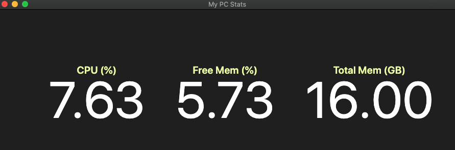

# Electron PC Stats Monitoring App
> An electron application which minotors your current CPU and memory usage of your PC.

## Installation
* Clone or download the repo

  `git clone git@github.com:dominicsanto/monitoring-app.git`

* Install node modules within directory

  `npm install`

* Run the application

  `npm run start`

## Tech Stack
1. [ElectronJS](https://www.electronjs.org/) - The Electron Framework

## How to Contribute
Pull requests are welcome. For major changes, please open an issue first to discuss what you would like to change. Please make sure to update tests as appropriate. If you'd like to contribute, please fork the repository and make changes as you'd like. Pull requests are warmly welcome.

Steps to contribute:
1. Fork this repository
2. Create your feature branch (git checkout -b feature/fooBar)
3. Commit your changes (git commit -am 'Add some fooBar')
4. Push to the branch (git push origin feature/fooBar)
5. Create a new Pull Request

## Author
Dominic Santo

[Github](https://github.com/dominicsanto)
[LinkedIn](https://www.linkedin.com/in/dominic-santo-7318aa77/)
